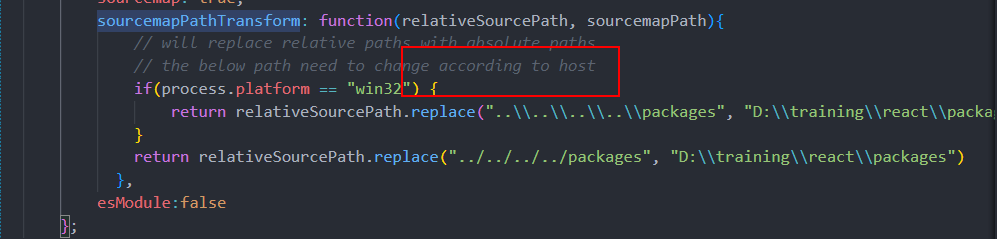

## Description

This repository is for leaning debugging the react source code

Original sample code is just a simple react program

## Start debug

* Make sure your node version is higher than or equal to : 16.13.0
* run `npm run start` on the this program root folder
* Open the debug session, click "Debug react"

you will see something like this:

## This chapter will add our built react package

* `git clone https://github.com/facebook/react`
* Modify the script `scripts/rollup/build.js`
    ** You can just copy the `utils/build.js to replace`, remember to change this
    

>NOTE:可以运行`sh utils/patch.sh`来直接完成替换脚本与build过程

## Last Step

build顺利完成后,${react_source_folder}/scripts/build/node_modules下面会生成带有`sourcemap`的文件夹,然后替换掉`${workSpaceFolder}/node_modules/react`和`${workSpaceFolder}/node_modules/react-dom`这两个文件夹