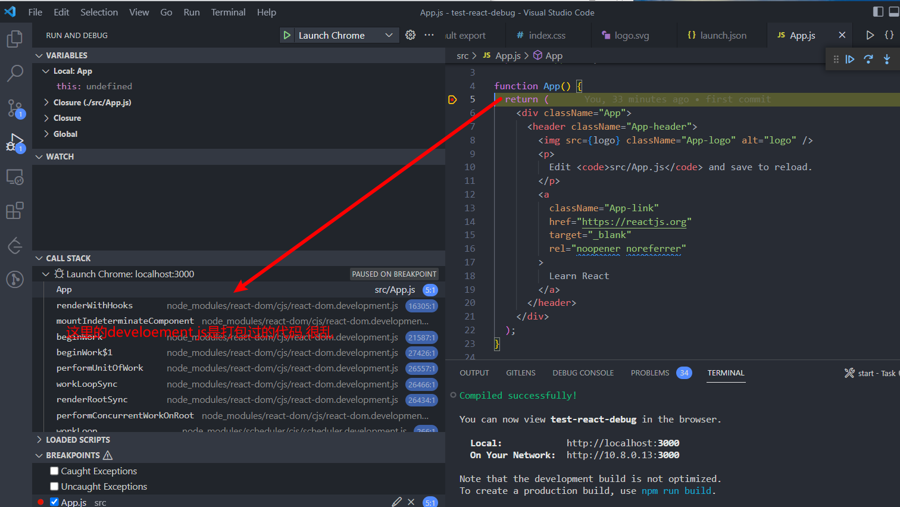

## Description

This repository is for leaning debugging the react source code

Original sample code is just a simple react program

## Start Debug

* Your node version is higher than or equal to : `16.13.0`
* run `npm run start` on this program root terminal
* Open the debug session, click "Debug react"

you will see something like this:

## NOTE

For debugging source react code, please refer to branch `build-react`